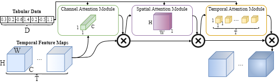
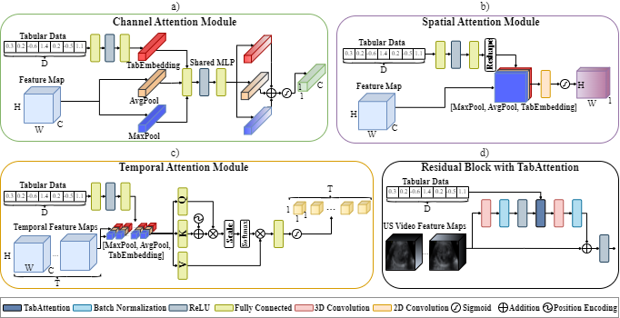

# TabAttention: Learning Attention Conditionally on Tabular Data



In this repository we provide the code for using TabAttention integrated with 3D ResNet-18. We provide the training
script with validation code in _train\_video.py_ and data loader with data augmentations in _video\_data\_loader.py_.
The code used for generating results for ML-based methods and Clinicians are presented in _ml\_methods.py_ and
_clinicians.py_ respectively. All SOTA methods and models that we used during experiments are available in
src/models/... files.



To install dependencies:

```shell
pip install -r requirements.txt
```